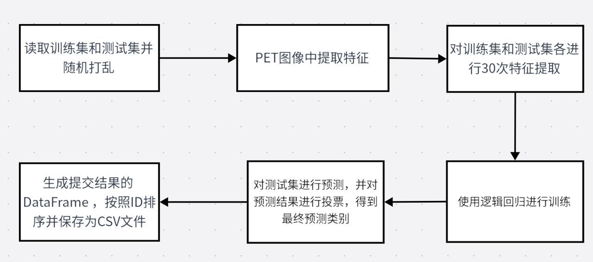
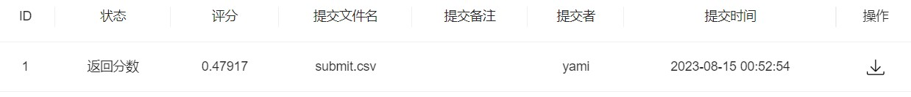
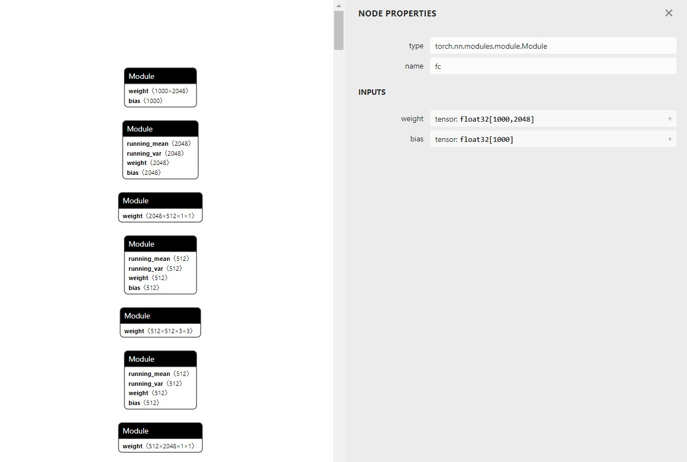

# 第一次学习笔记

## 本地环境搭建

```python
!pip install xxx
```


## 基于logistic回归

### 代码流程



### bug

1. baseline本地报错：
   linux与windows路径有区别，文件名未去除干净，baseline本地报错

```python
ValueError: invalid literal for int() with base 10: 'Test\\44'
```

原代码：

```python
'uuid': [int(x.split('/')[-1][:-4]) for x in test_path]
```

修改：

```python
'uuid': [int(x.split('\\')[-1][:-4]) for x in test_path]
```

### 得分



# 第二次学习笔记

## 基于深度学习CNN

### bug

1.

```
RuntimeError: "nll_loss_forward_reduce_cuda_kernel_2d_index" not implemented for 'Int': Pytorch
```

解决方案：将target转为LongTensor

```
target = target.type(torch.LongTensor)  
```

### 得分


## 代码

### 1.加载数据

```python
import os, sys, glob, argparse
import pandas as pd
import numpy as np
from tqdm import tqdm

import cv2
from PIL import Image
from sklearn.model_selection import train_test_split, StratifiedKFold, KFold

import torch
torch.manual_seed(0)#随机数生成器的种子设置为0
torch.backends.cudnn.deterministic = False
torch.backends.cudnn.benchmark = True

import torchvision.models as models
import torchvision.transforms as transforms
import torchvision.datasets as datasets
import torch.nn as nn
import torch.nn.functional as F
import torch.optim as optim
from torch.autograd import Variable
from torch.utils.data.dataset import Dataset

import nibabel as nib
from nibabel.viewers import OrthoSlicer3D

# 加载数据文件
train_path = glob.glob('./脑PET图像分析和疾病预测挑战赛公开数据/Train/*/*')
test_path = glob.glob('./脑PET图像分析和疾病预测挑战赛公开数据/Test/*')

# 打乱文件顺序
np.random.shuffle(train_path)
np.random.shuffle(test_path)

DATA_CACHE = {}
class XunFeiDataset(Dataset):
    def __init__(self, img_path, transform=None):
        self.img_path = img_path
        if transform is not None:
            self.transform = transform
        else:
            self.transform = None
            
    #预处理图像与获得标签
    def __getitem__(self, index):
        if self.img_path[index] in DATA_CACHE:
            img = DATA_CACHE[self.img_path[index]]
        else:
            img = nib.load(self.img_path[index]) 
            img = img.dataobj[:,:,:, 0]# 去除第4维
            DATA_CACHE[self.img_path[index]] = img
        
        # 随机选择一些通道（60）            
        idx = np.random.choice(range(img.shape[-1]), 60)
        img = img[:, :, idx]
        img = img.astype(np.float32)

        if self.transform is not None:
            img = self.transform(image = img)['image']
        
        img = img.transpose([2,0,1]) # 转成resnet输入所需
        return img,torch.from_numpy(np.array(int('NC' in self.img_path[index])))
    
    def __len__(self):
        return len(self.img_path)

# 图像增强
import albumentations as A
transform  = A.Compose([
             A.RandomRotate90(),
             A.RandomCrop(128, 128),
             A.HorizontalFlip(p=0.5),
             A.RandomBrightnessContrast(p=0.5),
         ])

# 加载数据集
train_loader = torch.utils.data.DataLoader(
    XunFeiDataset(train_path[:-10],transform), batch_size=20, shuffle=True, num_workers=0, pin_memory=False
)

val_loader = torch.utils.data.DataLoader(
    XunFeiDataset(train_path[-10:],transform), batch_size=20, shuffle=False, num_workers=0, pin_memory=False
)

test_loader = torch.utils.data.DataLoader(
    XunFeiDataset(test_path,transform), batch_size=20, shuffle=False, num_workers=0, pin_memory=False
)
```

### 2.定义CNN模型

```python
from torchvision.models import resnet50
class XunFeiNet(nn.Module):
    def __init__(self):
        super(XunFeiNet, self).__init__()
        
        # resnet18        
        model = models.resnet18(True)
        model.conv1 = torch.nn.Conv2d(60, 64, kernel_size=(7, 7), stride=(2, 2), padding=(3, 3), bias=True)
        model.avgpool = nn.AdaptiveAvgPool2d(1)
        model.fc = nn.Linear(512, 2)

#         # resnet50
#         model = models.resnet50(True)
#         # 初始卷积层 输入通道60 输出通道64，卷积核7*7，步长2,2，填充3*3
#         model.conv1 = torch.nn.Conv2d(60, 64, kernel_size=(7, 7), stride=(2, 2), padding=(3, 3), bias=True)
#         # 平均池化层替换为⾃适应平均池化层，1-*1
#         model.avgpool = nn.AdaptiveAvgPool2d(1)
#         # 全连接层替换为线性层，输⼊维度为 2048，输出维度为2（NC,MCI）
#         model.fc = nn.Linear(2048, 2)

        self.resnet = model
        
    # 前向传递    
    def forward(self, img):        
        out = self.resnet(img)
        return out
        
model = XunFeiNet()
model = model.to('cuda')
# 交叉熵损失函数
criterion = nn.CrossEntropyLoss().cuda()
# 梯度下降方法
optimizer = torch.optim.AdamW(model.parameters(), 0.0001)
```

### 3.模型训练与验证

```python
def train(train_loader, model, criterion, optimizer):
    # 模型设置为训练模式
    model.train()
    train_loss = 0.0
    for i, (input, target) in enumerate(train_loader):
        # 将训练集输入网络并得到当前结果
        input = input.cuda(non_blocking=True)
        target = target.cuda(non_blocking=True)
        output = model(input)
        # 计算损失
        loss = criterion(output, target.long())
        
        # 去除梯度
        optimizer.zero_grad()
        # 
        loss.backward()
        # 更新模型参数
        optimizer.step()
        
        # 20 次输出一次损失值
        if i % 20 == 0:
            print(f"lossitem:{loss.item()}")
            
        train_loss += loss.item()
    
    return train_loss/len(train_loader)
            
def validate(val_loader, model, criterion):
    # 模型设置为验证模式
    model.eval()
    val_acc = 0.0
    
    # 禁⽤梯度计算，提⾼计算速度
    with torch.no_grad():
        for i, (input, target) in enumerate(val_loader):
            # 将验证集输入网络并得到当前结果
            input = input.cuda()
            target = target.cuda()
            target = target.long()
            # 计算损失
            output = model(input)
            loss = criterion(output, target)
            
            # 判断模型输出是否与真实值相等
            val_acc += (output.argmax(1) == target).sum().item()
            
    return val_acc / len(val_loader.dataset)
    
for num in range(100):
    print(f"epoch:{num}")
    train_loss = train(train_loader, model, criterion, optimizer)
    val_acc  = validate(val_loader, model, criterion)
    train_acc = validate(train_loader, model, criterion)
    
    print(f"loss:{train_loss},train_acc:{train_acc},val_acc:{val_acc}")
    if train_acc*0.5+val_acc*0.5> 0.8&& train_loss<0.5:
        break
```


### 4.模型预测与提交

```python
def predict(test_loader, model, criterion):
    # 模型设置为验证模式
    model.eval()
    val_acc = 0.0
    
    test_pred = []
    with torch.no_grad():
        # i =num/batchsize
        for i, (input, target) in enumerate(test_loader):
            input = input.cuda()# torch.Size([20, 60, 120, 120])[bs,3d,width,height]
            target = target.cuda()# torch.Size([20])
            output = model(input)# [20,2][bs,2]
            
            test_pred.append(output.data.cpu().numpy())# [100,2]
            
    return np.vstack(test_pred)

# 预测
pred = None
for _ in range(10):
    if pred is None:
        pred = predict(test_loader, model, criterion)
    else:
        pred += predict(test_loader, model, criterion)
        
        
# 保存为csv文件
submit = pd.DataFrame(
    {
        'uuid': [int(x.split('\\')[-1][:-4]) for x in test_path],
        'label': pred.argmax(1)# 寻找最大值的index
})
# label中的1转换为NC，0转换为MCI
submit['label'] = submit['label'].map({1:'NC', 0: 'MCI'})
# 根据uuid进行升序排列
submit = submit.sort_values(by='uuid')
submit.to_csv('submit2.csv', index=None)
```

# 第三次学习笔记

## 1.预训练模型

### ResNet34

```python
from torchvision.models import resnet50
class XunFeiNet(nn.Module):
    def __init__(self):
        super(XunFeiNet, self).__init__()
        
        # resnet34        
        model = models.resnet34(True)
        model.conv1 = torch.nn.Conv2d(60, 64, kernel_size=(7, 7), stride=(2, 2), padding=(3, 3), bias=True)
        model.avgpool = nn.AdaptiveAvgPool2d(1)
        model.fc = nn.Linear(512, 2)
        self.resnet = model
        
    # 前向传递    
    def forward(self, img):        
        out = self.resnet(img)
        return out
```

### ResNet50

使用netron打开模型，可视化查看模型结构



修改全连接层输入维度为2048，输出维度为2

```python
        # resnet50
        model = models.resnet50(True)
        # 初始卷积层 输入通道60 输出通道64，卷积核7*7，步长2,2，填充3*3
        model.conv1 = torch.nn.Conv2d(60, 64, kernel_size=(7, 7), stride=(2, 2), padding=(3, 3), bias=True)
        # 平均池化层替换为⾃适应平均池化层，1-*1
        model.avgpool = nn.AdaptiveAvgPool2d(1)
        # 全连接层替换为线性层，输⼊维度为 2048，输出维度为2（NC,MCI）
        model.fc = nn.Linear(2048, 2)
```

## 2.数据增强方法

```python
import albumentations as A
transform  = A.Compose([
            A.RandomRotate90(),#  将输入随机旋转90度，零次或多次。
            A.RandomCrop(120, 120),# 随机裁剪
            A.HorizontalFlip(p=0.5),# 水平翻转
            A.VerticalFlip(p=0.5),# 垂直翻转
            A.RandomBrightnessContrast(p=0.3),# 随机更改输入图像的亮度和对比度
            A.ShiftScaleRotate(shift_limit=0.0625, scale_limit=0.2, rotate_limit=45, p=0.5),# 仿射变换 
        ])
```

## 3.模型交叉验证

```python
from sklearn.model_selection import train_test_split, StratifiedKFold, KFold
skf = KFold(n_splits=10, random_state=233, shuffle=True)

for fold_idx, (train_idx, val_idx) in enumerate(skf.split(train_path, train_path)):

    train_loader = torch.utils.data.DataLoader(
        XunFeiDataset(train_path[train_idx],transform), batch_size=20,
        shuffle=True, num_workers=0, pin_memory=False
    )
    
    val_loader = torch.utils.data.DataLoader(
        XunFeiDataset(train_path[val_idx],transform), batch_size=20,
        shuffle=True, num_workers=0, pin_memory=False
    )
    
    model = XunFeiNet()
    model = model.to('cuda')
    criterion = nn.CrossEntropyLoss().cuda()
    optimizer = torch.optim.AdamW(model.parameters(), 0.001)
    
    for _  in range(3):
        train_loss = train(train_loader, model, criterion, optimizer)
        val_acc  = validate(val_loader, model, criterion)
        train_acc = validate(train_loader, model, criterion)
        
        print(train_loss, train_acc, val_acc)
        torch.save(model.state_dict(), './resnet18_fold{0}.pt'.format(fold_idx))
```

